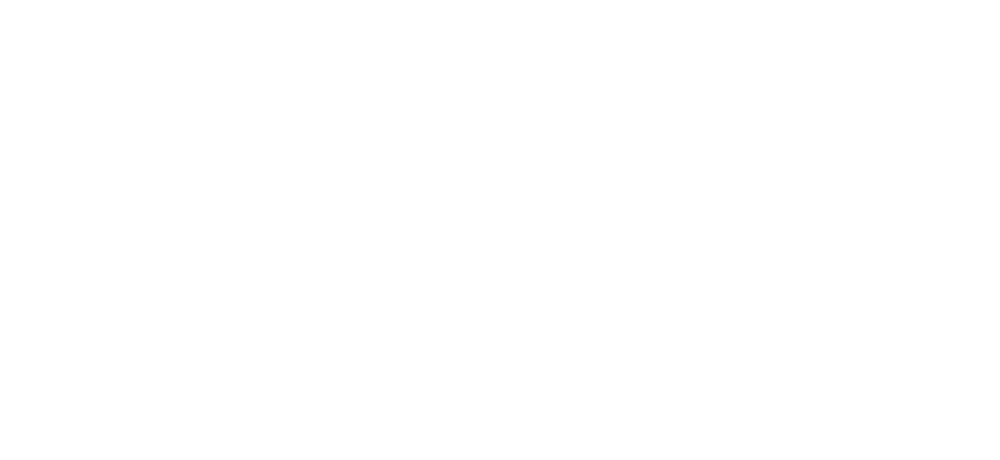
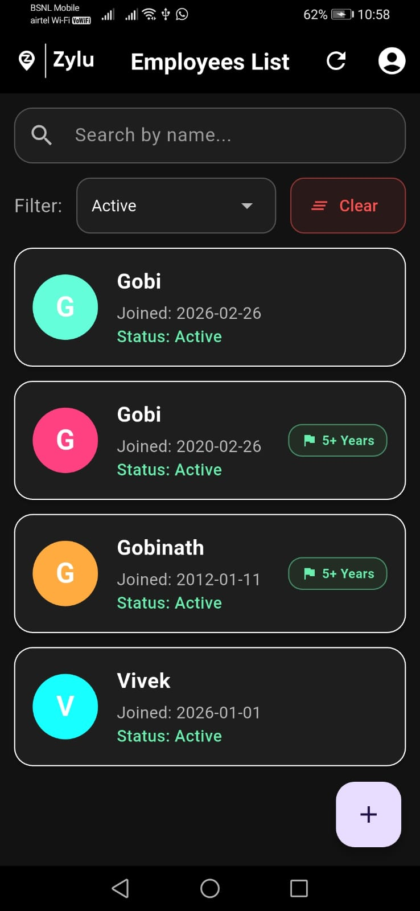
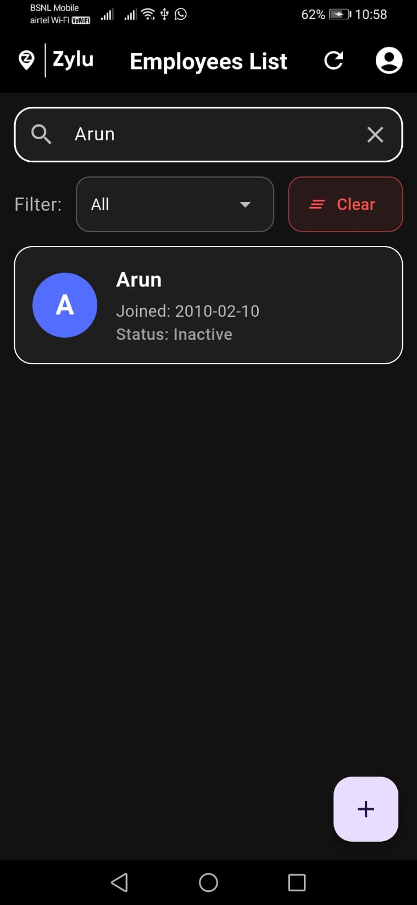
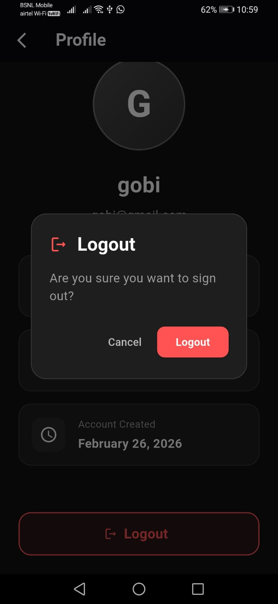

<div align="center">
  
  <h1>Premium Employee Management System</h1>

  <p>
    <strong>A high-performance, full-stack application demonstrating modern UI/UX principles, robust architecture, and seamless API integration.</strong>
  </p>

  <p>
    
    
    
    
    
    
  </p>
</div>

---

## 🎯 Project Overview

This project was developed to showcase an enterprise-ready employee management solution. It bridges a **Flutter (Dart) Mobile Application** with a **PHP Laravel Backend API**. The core focus was to deliver a visually stunning, highly responsive user interface while maintaining a strict, secure, and scalable backend architecture. 

It highlights my ability to build **end-to-end full-stack solutions**, handle state management effectively, architect RESTful APIs, and create intuitive user experiences.

---

## ✨ Key Features & Technical Highlights

### ⚡ Frontend (Flutter) Capabilities
* **Premium Dark UI:** Designed a modern, glassmorphism-inspired dark theme that prioritizes aesthetics and user engagement.
* **Intelligent Data Highlighting:** Implemented dynamic business logic to automatically flag employees with 5+ years of tenure with specialized UI indicators (Green flags/borders).
* **Real-time Search & Multi-layered Filtering:** Engineered a highly responsive search and filter system. Users can instantly filter the dataset by name, active/inactive status, and seniority *without* making redundant network calls.
* **Firebase Integration:** Seamlessly integrated Firebase Authentication and Cloud Firestore for secure user profile management, login, and customized logout confirmation flows.
* **Optimized State Management:** Handled asynchronous API data efficiently using `FutureBuilder`, ensuring smooth loading states and clean error handling.

### ⚙️ Backend (Laravel) Architecture
* **RESTful API Design:** Built clean, predictable API endpoints to handle CRUD operations for employee records.
* **Database Management:** Utilized Laravel Eloquent ORM and database migrations to cleanly structure a MySQL database.
* **Secure Data Transfer:** Ensured that data fetched and transmitted between the mobile app and the local server is structured logically and efficiently (JSON).

---

## 🚀 How to Run the Application

This application requires both the Laravel backend and the Flutter frontend to be running simultaneously.

### 1. Backend Setup (Laravel API)
1. Ensure you have **PHP**, **Composer**, and **XAMPP/WAMP** (for MySQL) installed.
2. Open your terminal and navigate to the backend directory (e.g., `cd employee-api`).
3. Install the dependencies:
   ```bash
   composer install
   ```
4. Copy `.env.example` to `.env` and generate an app key:
   ```bash
   cp .env.example .env
   php artisan key:generate
   ```
5. Configure your MySQL database credentials in the `.env` file (Database: `employee_db`, User: `root`).
6. Run the database migrations to create the necessary tables:
   ```bash
   php artisan migrate --seed
   ```
7. Start the local server:
   ```bash
   php artisan serve
   # The API will be available at http://127.0.0.1:8000
   ```

### 2. Frontend Setup (Flutter)
1. Ensure you have the **Flutter SDK** installed and configured.
2. Open the Flutter project directory (`cd zylu`).
3. Fetch the required Dart packages:
   ```bash
   flutter pub get
   ```
4. *Important:* Ensure the API base URL in `lib/controllers/employee_controller.dart` points to your active backend (use `http://10.0.2.2:8000` for the Android standard emulator).
5. Run the application on your preferred device/emulator:
   ```bash
   flutter run
   ```

---

## 📱 Screenshots

*(Add your high-quality screenshots here to immediately grab attention)*

|                             Employee List Dashboard                              |                          Real-time Search & Filter                          |                           Secure Profile & Logout                            |
|:--------------------------------------------------------------------------------:|:---------------------------------------------------------------------------:|:----------------------------------------------------------------------------:|
|  |  |  |

---

## 👨‍💻 About the Developer

I am a passionate software engineer focusing on building scalable, beautiful, and user-centric applications. This project demonstrates my proficiency in **cross-platform mobile development (Flutter)** and **robust backend engineering (Laravel)**.

* **Clean Code:** I adhere to modern coding standards, ensuring maintainability.
* **Problem Solving:** I prioritize elegant solutions to UI state and data flow.
* **User Experience:** I believe the application isn't finished until it feels completely natural to the end-user.

---
*Created with ❤️ & Flutter.*
